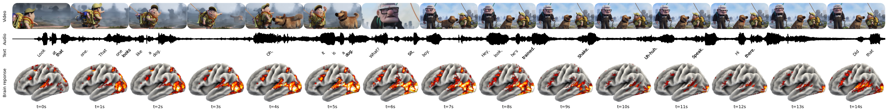

# Brain Response Mapping — Pixar's Up × Tribe v2

I ran a 14-second clip from Pixar's *Up* through Tribe v2, 
an AI brain encoding model, to generate a second-by-second 
predicted neural activation map of how a human brain responds 
to naturalistic audio-visual content.

What Is a Brain Encoding Model?
A brain encoding model is an AI trained on real fMRI data from 
subjects watching naturalistic video. It learns the statistical 
relationship between what a person sees, hears, and reads — and 
which brain regions activate in response. Given a new video input, 
it predicts the neural response across the cortical surface.

Output
Each frame in the output corresponds to one second (t=0s to t=14s). 
The 3D brain is rendered laterally (side view). Activation intensity 
is represented as a heatmap: red (moderate) → orange → yellow 
(peak activation).

Peak Activation Moment — t=4s to t=5s
The most intense activation across the entire clip occurs at t=4–5s. 
Three inputs converge simultaneously: a novel visual object (the dog), 
a sharp audio peak, and semantically meaningful speech ("Oh, it is a 
dog."). This is a textbook case of Multimodal Convergence, 
producing a *Prediction Error Response — the brain registers 
novelty and floods relevant circuits with activity.

Implications
This experiment demonstrates that neural responses to naturalistic 
stimuli are, to a measurable degree, predictable by AI. The inverse 
of this process — *Neural Decoding* — allows researchers to 
reconstruct perceived stimuli from brain activity alone. This 
experiment is a forward pass of that same pipeline.

## Tools
- AI Model: Tribe v2  
- Input: 14-second clip, Pixar's *Up*  
